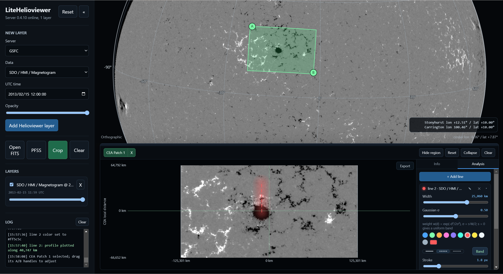

# LiteHelioviewer

English | [中文](README.zh.md)

A lightweight local web viewer for solar images from the Helioviewer API. It grew out of [JHelioviewer-SWHV](https://github.com/Helioviewer-Project/JHelioviewer-SWHV), which is mature and complete but a bit heavy when I just want a quick look at the Sun. LiteHelioviewer keeps the everyday workflow — load recent SDO/HMI, AIA and LASCO frames, stack layers, rotate the disk — and adds the small things I kept missing: cropping a patch and drawing lines on it. Everything runs locally except the image downloads themselves.



## Quick start

Windows: double-click `run-litehelioviewer.bat`. It finds a Python 3.9+ interpreter, installs the requirements on first run, starts the backend and opens the browser.

Any OS:

```
pip install -r requirements.txt
python start.py
```

## Basic use

Pick a layer, a date and a time, and load it. Drag the disk to rotate it, scroll to zoom. Local FITS files can be dropped onto the window, and PFSS field lines can be overlaid.

Click **Crop** and drag two points on the disk to mark a region. Each region opens as a CEA-projected patch in the bottom dock, with axes in kilometers; the patch can be zoomed and panned to inspect details. In crop mode, click a green region to select it and adjust its two corners again.

On a patch you can draw analysis lines, freehand or bezier. Each line has a width and a Gaussian weighting across it, and the plot button renders the straightened strip of the line together with the intensity profile along it.

## Recent changes

- Patches can be exported as clean PNG/JPG images, drawn lines included.
- Lines are now anchored in Carrington coordinates, so adjusting a crop region only moves the viewing window — the lines stay put on the Sun.
- Lines can be colored, from a palette or a custom color picker.

## Planned

Time-series visualization for crop regions at fixed Carrington coordinates.
